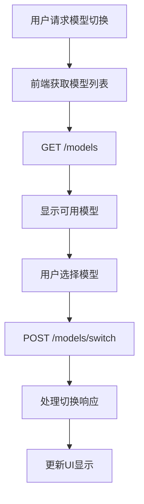
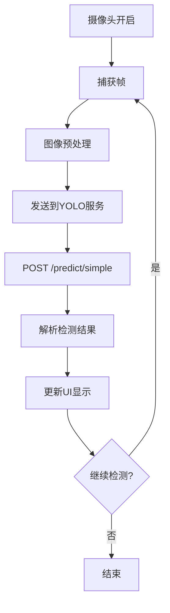

# SWOLO-Platform API 参考文档

本文档详细描述了 SWOLO-Platform 中所有可用的 API 端点，包括前端与后端之间的通信接口以及 YOLO 预测服务的 API。

## 目录

1. [YOLO 预测服务 API](#yolo-预测服务-api)
2. [前端服务 API](#前端服务-api)
3. [错误处理](#错误处理)
4. [认证与授权](#认证与授权)
5. [常见用例](#常见用例)

## YOLO 预测服务 API

YOLO 预测服务运行在默认端口 5000 上，提供基于 HTTP 的 RESTful API 接口。

### 服务信息

- **基础 URL**: `http://[HOST]:[PORT]` (默认: `http://localhost:5000`)
- **内容类型**: `application/json` (除特殊说明外)
- **最大请求大小**: 100MB

### 通用响应格式

所有 API 响应都遵循以下格式：

```json
{
  "success": true/false,
  "result": {...},  // 成功时包含结果数据
  "error": {        // 失败时包含错误信息
    "code": "错误代码",
    "message": "错误消息"
  },
  "message": "描述性消息"
}
```

### 端点列表

#### 1. 健康检查

##### GET /

检查服务的基本健康状态。

**请求参数**: 无

**成功响应示例**:
```json
{
  "status": "healthy",
  "version": "1.0.0",
  "model_loaded": true
}
```

##### GET /health

同上，检查服务的健康状态。

#### 2. 通用图像预测

##### POST /predict

执行通用对象检测。

**请求方式 1: 文件上传**
- **内容类型**: `multipart/form-data`
- **参数**: 
  - `image`: 图像文件
  - `return_image`: (可选) 是否返回处理后的图像 (true/false)

**请求方式 2: 表单数据**
- **内容类型**: `application/x-www-form-urlencoded`
- **参数**:
  - `image_base64`: base64编码的图像数据
  - `return_image`: (可选) 是否返回处理后的图像 (true/false)

**成功响应示例**:
```json
{
  "detections": [
    {
      "class": "object_class",   // 检测到的对象类别
      "confidence": 0.85,        // 检测置信度
      "x": 100,                  // 边界框左上角x坐标
      "y": 150,                  // 边界框左上角y坐标
      "width": 50,               // 边界框宽度
      "height": 60               // 边界框高度
    }
  ],
  "detection_count": 1,         // 检测到的对象数量
  "result_image": "base64..."   // (可选) 处理后的图像，当return_image=true时返回
}
```

#### 3. 简单预测

##### POST /predict_simple

执行简单对象检测，不返回处理后的图像。

**请求方式 1: 文件上传**
- **内容类型**: `multipart/form-data`
- **参数**: 
  - `image`: 图像文件

**请求方式 2: 表单数据**
- **内容类型**: `application/x-www-form-urlencoded`
- **参数**:
  - `image_base64`: base64编码的图像数据

**成功响应示例**:
```json
{
  "detections": [
    {
      "class": "object_class",   // 检测到的对象类别
      "confidence": 0.85,        // 检测置信度
      "x": 100,                  // 边界框左上角x坐标
      "y": 150,                  // 边界框左上角y坐标
      "width": 50,               // 边界框宽度
      "height": 60               // 边界框高度
    }
  ],
  "detection_count": 1          // 检测到的对象数量
}
```

#### 4. 滴定实验分析

##### POST /predict/titration

分析滴定实验图像，检测颜色变化、终点、体积和浓度等信息。

**请求格式**:
```json
{
  "image_data": "base64编码的图像数据",
  "options": {  // 可选字段
    // 分析选项，具体取决于实现
  }
}
```

**请求参数**:
- `image_data` (string, 必需): base64编码的图像数据
- `options` (object, 可选): 分析选项

**成功响应示例**:
```json
{
  "success": true,
  "result": {
    "color": "colorless",      // 检测到的颜色
    "endPointReached": false,  // 是否到达滴定终点
    "volume": 24.5,            // 检测到的体积值
    "concentration": 0.1023,   // 检测到的浓度值
    "confidence": 0.95         // 检测置信度
  },
  "message": "Titration analysis completed successfully"
}
```

#### 5. 浓度检测

##### POST /predict/concentration

检测图像中的浓度值。

**请求格式**:
```json
{
  "image_data": "base64编码的图像数据",
  "options": {  // 可选字段
    // 分析选项，具体取决于实现
  }
}
```

**请求参数**:
- `image_data` (string, 必需): base64编码的图像数据
- `options` (object, 可选): 分析选项

**成功响应示例**:
```json
{
  "success": true,
  "result": {
    "concentration": 0.1023,  // 检测到的浓度值
    "color": "light_blue",    // 检测到的颜色
    "confidence": 0.92        // 检测置信度
  },
  "message": "Concentration detection completed successfully"
}
```

#### 6. 粒子表征分析

##### POST /predict/characterization

执行粒子检测并返回详细的检测结果。

**请求格式**:
```json
{
  "image_data": "base64编码的图像数据",
  "options": {  // 可选字段
    // 分析选项，具体取决于实现
  }
}
```

**请求参数**:
- `image_data` (string, 必需): base64编码的图像数据
- `options` (object, 可选): 分析选项

**成功响应示例**:
```json
{
  "success": true,
  "result": {
    "detections": [
      {
        "class": "particle_type",  // 检测到的粒子类别
        "confidence": 0.95,        // 检测置信度
        "x": 100,                  // 边界框左上角x坐标
        "y": 150,                  // 边界框左上角y坐标
        "width": 50,               // 边界框宽度
        "height": 60               // 边界框高度
      }
    ],
    "detection_count": 1           // 检测到的对象数量
  },
  "message": "Particle characterization completed successfully"
}
```

#### 7. 模型信息

##### GET /info

获取当前加载模型的信息。

**请求参数**: 无

**成功响应示例**:
```json
{
  "model_path": "./model_data/MOF.pth",     // 模型文件路径
  "model_type": "YOLOv5",                 // 模型类型
  "classes_path": "./model_data/voc_classes.txt", // 类别文件路径
  "anchors_path": "./model_data/yolo_anchors.txt", // 锚框文件路径 (YOLOv5)
  "num_classes": 80,                      // 类别数量
  "class_names": ["class1", "class2"],    // 类别名称列表
  "input_shape": [416, 416],              // 模型输入形状
  "confidence": 0.5,                      // 置信度阈值
  "nms_iou": 0.3                          // NMS IOU阈值
}
```

对于 YOLOv8 模型，响应格式略有不同：
```json
{
  "model_type": "YOLOv8",
  "model_path": "./model_data/GLU.pth",
  "classes_path": "./model_data/glu_classes.txt",
  "num_classes": 1,
  "class_names": ["glu"],
  "input_shape": [640, 640],
  "confidence": 0.5,
  "nms_iou": 0.3,
  "phi": "s"                              // YOLOv8 版本
}
```

#### 8. 可用模型列表

##### GET /models

获取所有可用模型的列表。

**请求参数**: 无

**成功响应示例**:
```json
{
  "success": true,
  "models": [
    {
      "name": "MOF",                      // 模型名称
      "model_path": "./model_data/MOF.pth",     // 模型文件路径
      "classes_path": "./model_data/voc_classes.txt", // 对应类别文件路径
      "model_type": "v5",                 // 模型类型 (v5 或 v8)
      "is_current": true                  // 是否为当前使用的模型
    },
    {
      "name": "5101520",                  // 模型名称
      "model_path": "./model_data/5101520.pth", // 模型文件路径
      "classes_path": "./model_data/concentration_classes.txt", // 对应类别文件路径
      "model_type": "v5",                 // 模型类型 (v5 或 v8)
      "is_current": false                 // 是否为当前使用的模型
    },
    {
      "name": "GLU",                      // 模型名称
      "model_path": "./model_data/GLU.pth",     // 模型文件路径
      "classes_path": "./model_data/glu_classes.txt", // 对应类别文件路径
      "model_type": "v8",                 // 模型类型 (v5 或 v8)
      "is_current": false                 // 是否为当前使用的模型
    }
  ]
}
```

#### 9. 模型切换

##### POST /models/switch

切换到指定的模型。

**请求格式**:
```json
{
  "model_name": "MOF"  // 要切换到的模型名称
}
```

**请求参数**:
- `model_name` (string, 必需): 要切换到的模型名称

**成功响应示例**:
```json
{
  "success": true,
  "message": "Model switched to MOF successfully",
  "current_model": {
    "model_type": "YOLOv5",
    "model_path": "./model_data/MOF.pth",     // 模型文件路径
    "classes_path": "./model_data/voc_classes.txt", // 类别文件路径
    "anchors_path": "./model_data/yolo_anchors.txt", // 锚框文件路径
    "num_classes": 1,                       // 类别数量
    "class_names": ["MOF"],                 // 类别名称列表
    "input_shape": [416, 416],              // 模型输入形状
    "confidence": 0.5,                      // 置信度阈值
    "nms_iou": 0.3                          // NMS IOU阈值
  }
}
```

**错误响应示例**:
```json
{
  "success": false,
  "error": {
    "code": "MODEL_NOT_FOUND",
    "message": "Model nonexistent_model not found"
  },
  "message": "Model nonexistent_model not found"
}
```

### 错误代码

| 错误代码 | 说明 |
|---------|------|
| INVALID_REQUEST | 请求格式无效或缺少必需参数 |
| MODEL_ERROR | 模型处理时发生错误 |
| REQUEST_BODY_TOO_LARGE | 请求体过大 |
| SERVICE_ERROR | 服务未初始化 |
| MODEL_NOT_FOUND | 指定的模型未找到 |
| MODEL_SWITCH_ERROR | 模型切换失败 |
| IMAGE_PROCESSING_ERROR | 图像处理错误 |

### 图像格式要求

- 支持的格式: JPEG, PNG, BMP, GIF, TIFF
- 最大文件大小: 100MB
- 图像数据应使用 base64 编码

## 前端服务 API

前端通过 [apiService.ts](file:///F:/SWOLO-Platform2.0/frontend/SWOLO-Platform/src/services/apiService.ts) 与后端服务通信，提供以下功能：

### API 配置

```typescript
const API_CONFIG = {
  baseUrl: process.env.YOLO_SERVER_URL || 'http://localhost:5000',
  timeout: 30000,
  retries: 3
};
```

### 主要服务函数

#### 1. 服务器连接检查

```typescript
async function checkServerConnection(): Promise<boolean>
```

检查与 YOLO 预测服务的连接状态。

#### 2. 模型切换

```typescript
async function switchModel(modelName: string): Promise<any>
```

切换 YOLO 预测服务中的模型。

**参数**:
- `modelName`: 要切换到的模型名称

#### 3. 图像预测

```typescript
async function predictImage(imageData: string, endpoint: string = '/predict'): Promise<any>
```

发送图像到 YOLO 服务进行预测。

**参数**:
- `imageData`: base64 编码的图像数据
- `endpoint`: 预测端点 (默认: '/predict')

#### 4. 滴定分析

```typescript
async function analyzeTitration(imageData: string): Promise<any>
```

执行滴定实验分析。

#### 5. 浓度检测

```typescript
async function detectConcentration(imageData: string): Promise<any>
```

执行浓度检测。

#### 6. 表征分析

```typescript
async function characterizeParticles(imageData: string): Promise<any>
```

执行粒子表征分析。

#### 7. 获取模型列表

```typescript
async function getAvailableModels(): Promise<any>
```

获取可用模型列表。

#### 8. 获取当前模型信息

```typescript
async function getCurrentModelInfo(): Promise<any>
```

获取当前使用的模型信息。

### Electron IPC 通信

前端通过 Electron 的 IPC (Inter-Process Communication) 机制与主进程通信：

#### 1. 文件选择

```typescript
async function openFile(): Promise<any>
```

打开文件对话框以选择文件。

#### 2. 配置加载

```typescript
async function loadConfig(): Promise<any>
```

从主进程加载配置。

#### 3. 服务器连接检查

```typescript
async function checkServerConnection(url?: string): Promise<any>
```

检查服务器连接状态。

## 错误处理

### HTTP 状态码

- `200 OK`: 请求成功
- `400 Bad Request`: 请求格式错误
- `404 Not Found`: 请求的资源不存在
- `413 Request Entity Too Large`: 请求体过大
- `500 Internal Server Error`: 服务器内部错误

### 错误响应格式

错误响应遵循通用响应格式：

```json
{
  "success": false,
  "error": {
    "code": "错误代码",
    "message": "详细错误消息"
  },
  "message": "用户友好的错误消息"
}
```

## 认证与授权

当前版本的 API 不需要认证，但建议在生产环境中实施以下安全措施：

1. 使用 HTTPS 加密通信
2. 实现 API 速率限制
3. 验证请求来源（CORS 策略）
4. 输入数据验证和清理

## 常见用例

### 1. 图像检测工作流

```mermaid
graph TD
    A[用户上传图像] --> B[前端预处理图像]
    B --> C[发送到YOLO服务]
    C --> D{选择检测类型}
    D -->|滴定分析| E[/predict/titration]
    D -->|浓度检测| F[/predict/concentration]
    D -->|粒子表征| G[/predict/characterization]
    D -->|通用检测| H[/predict]
    E --> I[处理响应]
    F --> I
    G --> I
    H --> I
    I --> J[显示结果]
```

### 2. 模型管理工作流



### 3. 实时检测工作流



## 性能考虑

1. **请求大小**: 单个请求不应超过 100MB
2. **图像尺寸**: 建议调整图像尺寸以平衡精度和性能
3. **并发请求**: 控制并发请求数量以避免服务过载
4. **缓存策略**: 对于频繁请求的数据，考虑实施缓存

## 故障排除

### 常见问题

1. **连接错误**: 检查服务是否运行在正确的端口
2. **模型加载失败**: 验证模型文件路径和权限
3. **内存不足**: 检查系统资源和模型大小
4. **响应超时**: 调整超时设置或优化模型性能

### 调试技巧

1. 使用浏览器开发者工具检查网络请求
2. 查看 YOLO 服务日志
3. 验证请求和响应格式
4. 使用 Postman 或 curl 测试 API 端点

## 更新历史

- **v1.0.0**: 初始版本，包含基本的 YOLO 预测 API
- **v1.1.0**: 添加模型管理和切换功能
- **v1.2.0**: 添加专门的检测端点（滴定、浓度、表征）
- **v1.3.0**: 添加前端服务 API 和 Electron 集成

## 联系支持

如需技术支持，请参考：
- 项目文档
- 提交 GitHub Issue
- 联系开发团队